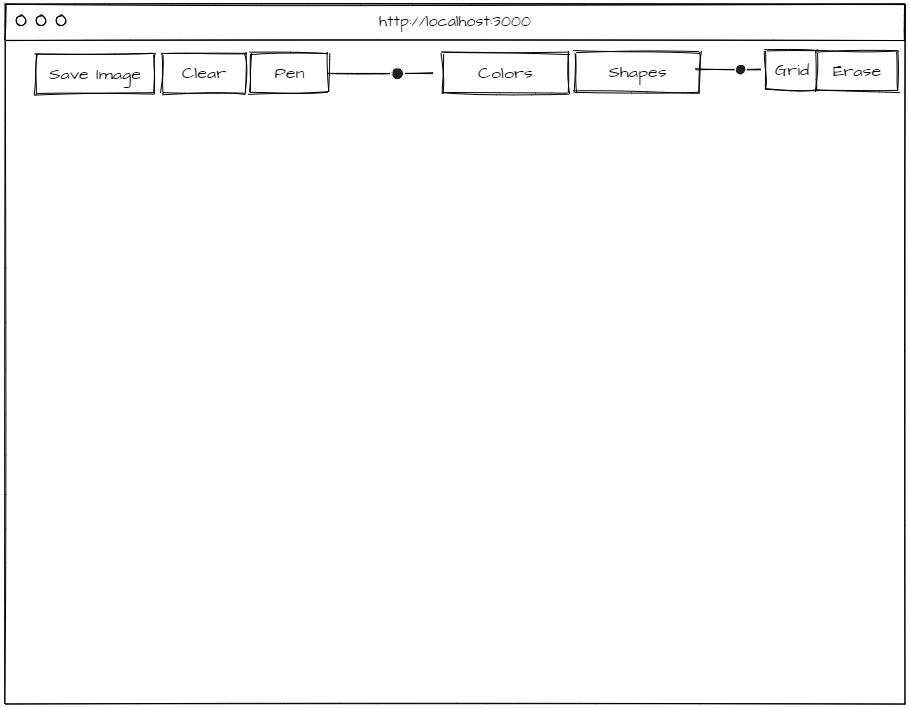

# Quizical
* [App Link](https://seongsp.github.io/ArdentDraw/)

## App Summary
A whiteboard app with functions such as drawing shapes and saving images.

## Wireframe

## Wireframe
* As a user, I can choose my pen width and colors
* As a user, I can toggle the grid on and off with varying grid sizes
* As a user, I can draw with my pen
* As a user, I can erase with my pen
* As a user, I can choose a circle, square or rectangle shape
* As a user, I can clear the whiteboard
* As a user, I can save the current image to my desktop

## Technologies Used
* HTML
* CSS
* JavaScript
* jQuery

## Approach
* Started by developing the user stories to break down the problem and make UX design choices
* Developed the easier sections first and tested them (Drawing with pen and clearing the board)
* Developed the latter functions one by one until reaching the finished product
